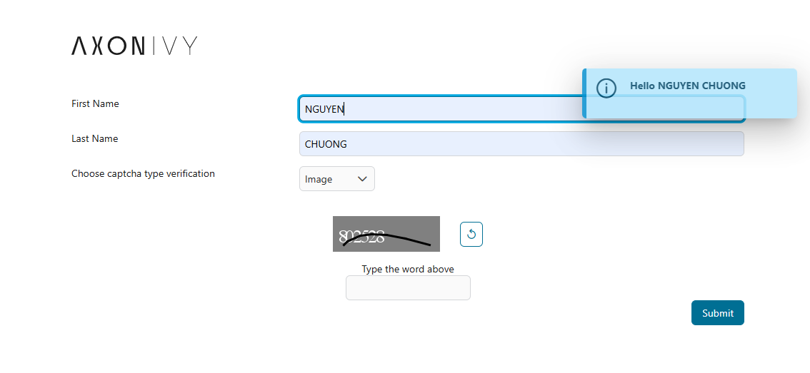
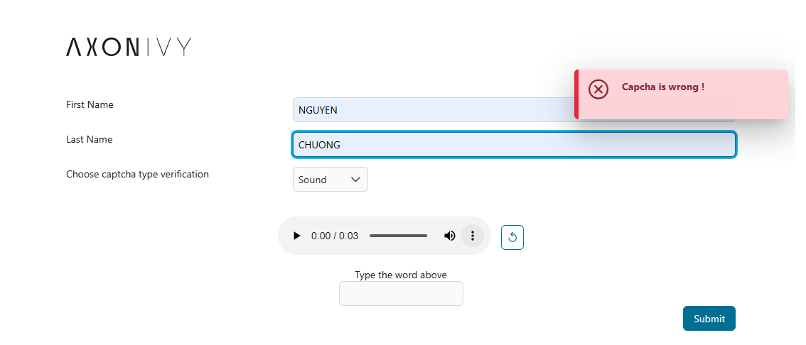

# CAPTCHA UTILS

A comprehensive utility for generating and verifying image and audio CAPTCHAs to secure your application from bot and automated attacks. 
This tool ensures that user interactions are authentic, providing a robust layer of defense for forms, logins, and other critical areas of your application.
## Demo

### 🚀 Key features:
  - Generate Image CAPTCHA: Create customizable image-based challenges.
  - Generate Audio CAPTCHA: Provide accessible audio challenges for visually impaired users.
  - Verify CAPTCHA: A simple and reliable way to validate user input against the generated CAPTCHA value.

### ✨ Function Details:
- Generate Image CAPTCHA - this function creates a unique image-based CAPTCHA with several customizable options:
  - Dimensions: Specify the exact width and height of the CAPTCHA image to fit your UI.
  - Content Type: Define the characters to be used in the CAPTCHA. You can choose from numbers, Latin characters, etc...
  - CAPTCHA Length: Control the number of characters in the CAPTCHA string.
  - Noise: Add different types of visual noise to the image, such as straight lines or curved lines, to make it harder for bots to read.
  - Background: Customize the background type and specify color of the CAPTCHA image.

You can collect all requirements and parse it to the function generateImageCaptcha then it will provide you the Captcha image as you want

	 
- Generate Audio CAPTCHA - this function creates an audio file that reads out the CAPTCHA characters, offering an accessible alternative to the image CAPTCHA:
  - Content Type: The content of the audio CAPTCHA is based on the voice producer, you can choose the locale, there are many country locales you can choose.
  - Optional Sound Noise: Add a layer of background noise to the audio file to prevent automated transcription. This feature enhances security for the audio CAPTCHA.

- Verify captcha if is valid and match - this function provides a straightforward method to check if a user's input matches the correct CAPTCHA value.
  - How it Works: The function compares the user-submitted string with the actual CAPTCHA value stored on the server.
  - Verification: It returns a boolean result (true if the values match, false otherwise), allowing you to proceed with the user's action or prompt them to try again.

