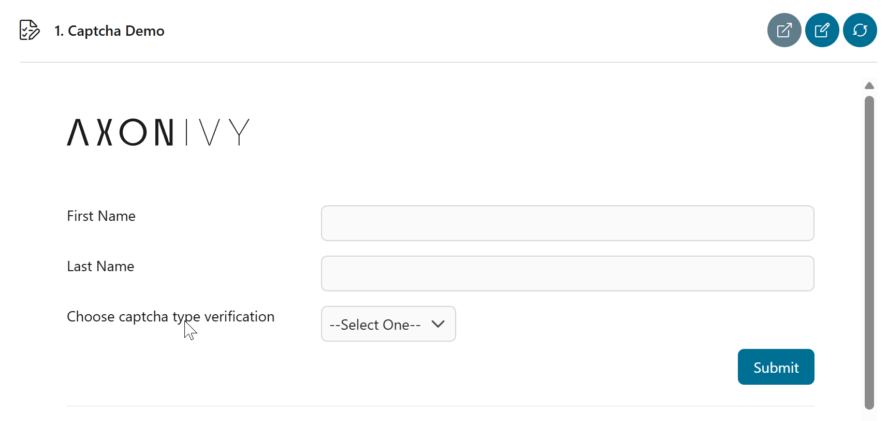
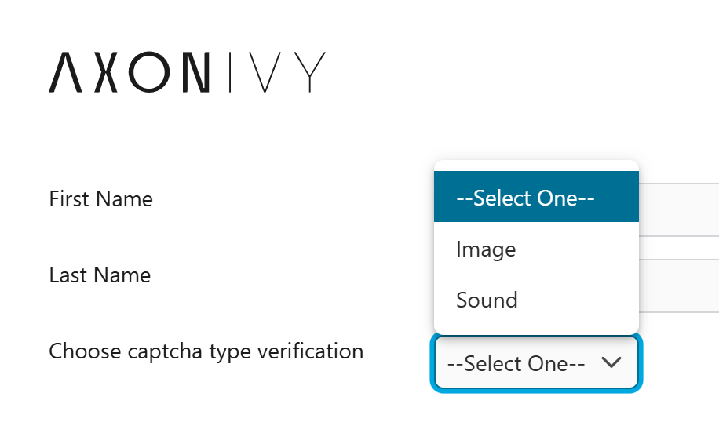

# CAPTCHA-UTILS

Ein umfassendes Dienstprogramm zum Generieren und Überprüfen von Bild- und
Audio-CAPTCHAs, um Ihre Anwendung vor Bot- und automatisierten Angriffen zu
schützen. Dieses Tool stellt sicher, dass Benutzerinteraktionen authentisch
sind, und bietet einen robusten Schutz für Formulare, Anmeldungen und andere
kritische Bereiche Ihrer Anwendung.

### Wichtigste Funktionen:
* **Bild-CAPTCHA generieren:** Erstellen Sie anpassbare bildbasierte
  Herausforderungen.
* **Audio-CAPTCHA generieren:** Bieten Sie barrierefreie Audio-Herausforderungen
  für sehbehinderte Benutzer.
* **CAPTCHA überprüfen:** Eine einfache und zuverlässige Methode, um
  Benutzereingaben anhand des generierten CAPTCHA-Werts zu überprüfen.

### Funktionsdetails:  
Bild-CAPTCHA generieren – diese Funktion erstellt ein einzigartiges
bildbasiertes CAPTCHA mit mehreren anpassbaren Optionen:
* **Abmessungen:** Geben Sie die genaue Breite und Höhe des CAPTCHA-Bildes an,
  damit es zu Ihrer Benutzeroberfläche passt.
* **Inhaltstyp:** Definieren Sie die Zeichen, die im CAPTCHA verwendet werden
  sollen. Sie können zwischen Zahlen, lateinischen Buchstaben usw. wählen.
* **CAPTCHA-Länge:** Steuert die Anzahl der Zeichen in der CAPTCHA-Zeichenfolge.
* **Rauschen:** Fügen Sie dem Bild verschiedene Arten von visuellem Rauschen
  hinzu, z. B. gerade oder gekrümmte Linien, um das Lesen für Bots zu
  erschweren.
* **Hintergrund:** Passen Sie den Hintergrundtyp an und legen Sie die Farbe des
  CAPTCHA-Bildes fest.

Audio-CAPTCHA generieren – diese Funktion erstellt eine Audiodatei, die die
CAPTCHA-Zeichen vorliest und eine barrierefreie Alternative **** zum
Bild-CAPTCHA bietet:
* **Inhaltstyp:** Der Inhalt des Audio-CAPTCHAs basiert auf dem
  Sprachproduzenten. Sie können die Sprache auswählen, es stehen viele
  Ländersprachen zur Auswahl.
* **Optionales Hintergrundgeräusch:** Fügen Sie der Audiodatei eine Ebene mit
  Hintergrundgeräuschen hinzu, um eine automatische Transkription zu verhindern.
  Diese Funktion erhöht die Sicherheit für das Audio-CAPTCHA.

## Demo

1. Start the demo process "Verify Captcha"
   

2. Sie können zwischen Bild- und Sprachverifizierung wählen.

Informationen für Entwickler: Die Funktion „ `generateImageCaptcha` ” wird im
Hintergrund verwendet, um das Captcha-Bild basierend auf den Eingaben und
Einstellungen des Benutzers zu generieren.

### Bildüberprüfung

### Audioüberprüfung

